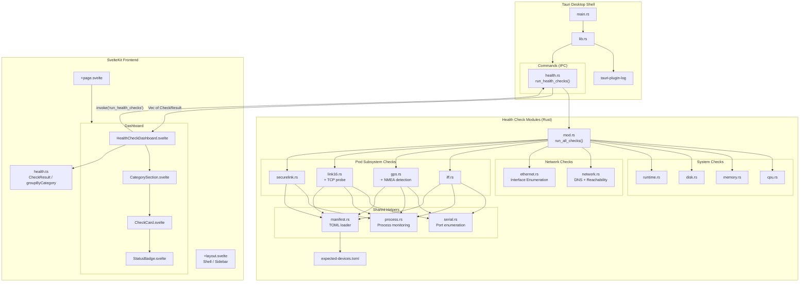

# Software Architecture

> Current state of the GI Health Check desktop application.

## Layer Summary

| Layer | Technology | Role |
|-------|-----------|------|
| Desktop Shell | Tauri v2 (Rust) | Native window, IPC, packaging |
| Frontend | SvelteKit + TypeScript | Dashboard UI, result rendering |
| Commands | Tauri IPC | Bridge between UI and Rust checks |
| System Checks | Rust (sysinfo) | CPU, memory, disk, hostname, OS |
| Network Checks | Rust (tokio, sysinfo) | DNS, internet reachability, interface enumeration |
| Pod Subsystems | Rust (serialport, tokio) | IFF, GPS, Link 16, Secure Link |
| Helpers | Rust (serialport, sysinfo, toml) | Serial port, process, manifest utilities |
| Configuration | TOML | Expected device manifest |

## Data Flow

1. User clicks **Run Checks** in the SvelteKit dashboard
2. Frontend calls `invoke('run_health_checks')` via Tauri IPC
3. Rust `run_all_checks()` executes all check modules sequentially
4. Pod subsystem checks load `expected-devices.toml` and validate against actual hardware
5. Results return as `Vec<CheckResult>` with pass/warn/fail status
6. Frontend groups results by category and renders them dynamically
