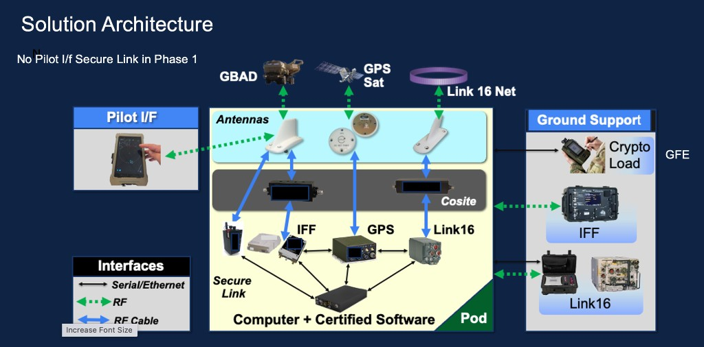
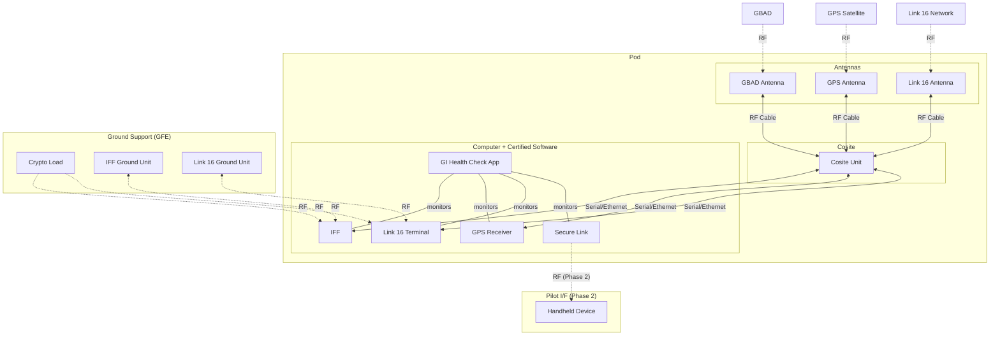

# Solution Architecture

> Synthesized from the GI Orchestrator solution architecture diagram.
> The **GI Health Check** app runs on the **Computer + Certified Software** inside the Pod.

## Mermaid Diagram

## Interface Legend

| Line Style | Interface Type |
|------------|---------------|
| `<-->` solid | Serial / Ethernet |
| `-.->` dashed | RF |
| `<===>` bold | RF Cable |
| `---` plain | Internal monitoring |

## Notes

- **No Pilot I/F Secure Link in Phase 1** -- the Pilot handheld connection is deferred.
- The GI Health Check app runs directly on the Pod computer alongside the certified mission software.
- It monitors IFF, GPS, Link 16, and Secure Link subsystems via Serial/Ethernet interfaces.
- Ground Support equipment (Crypto Load, IFF, Link 16) are Government Furnished Equipment (GFE) connected via RF.
